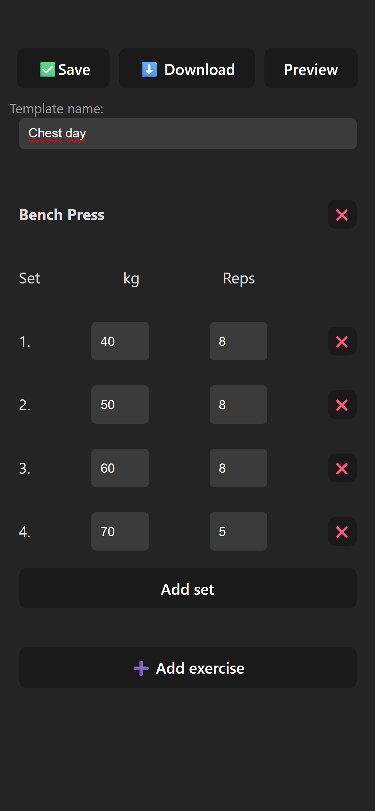
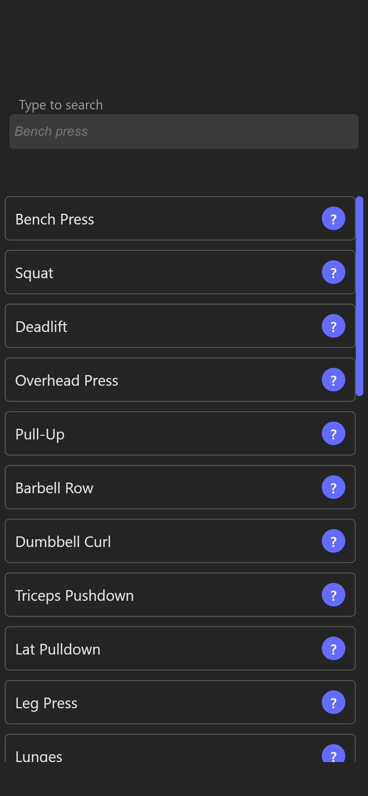

# Workout Planner

A lightweight React application for creating, managing, and exporting workout templates. Planning exercises, sets, reps, and weights — all in browser, without a backend.
Project made fully for learning purposes.
---

## Features

- Create and edit workout templates
- Add exercises, sets, reps, and weight
- Save templates to **Local Storage**
- Export templates to **PDF** file with comfortable tables
- Responsive design for desktop and mobile
- Searchable list of popular exercises

##Used in this project
- React hooks: state, effect, context, navigate, memo
- CSS layouts: flexbox, grid
- External libraries: jsPDF, jsPDFAutoTable
---

## Screenshots

<div style="display: flex; gap: 20px; justify-content: center; flex-wrap: wrap;">

  

  

  

</div>


---

## Getting Started

```bash
git clone https://github.com/yourusername/workout-planner.git
cd workout-planner
npm install
npm run dev
